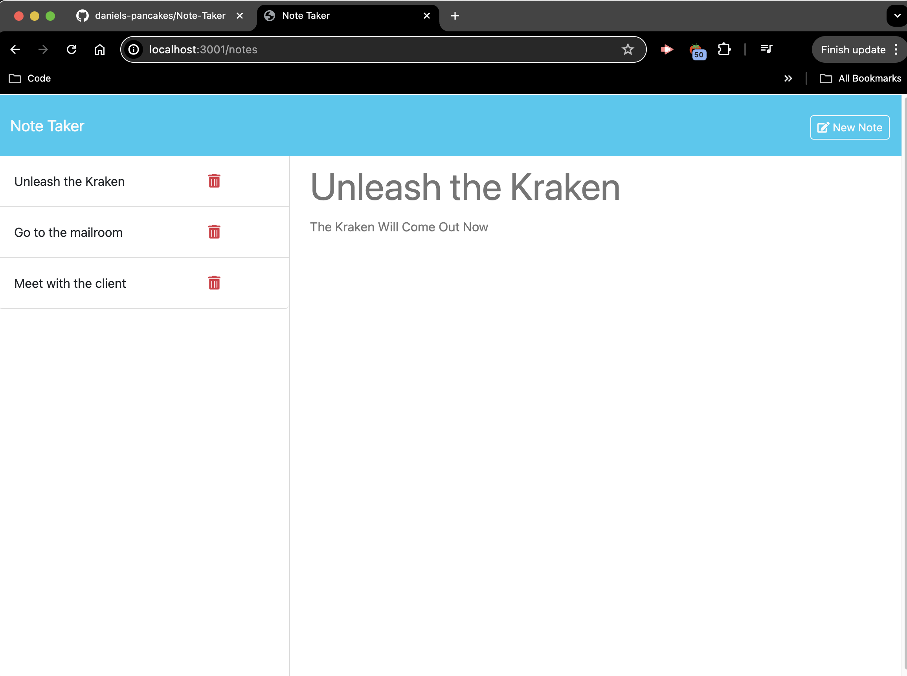

# Note Taker

## Description
The Note Taker is a web application for professionals to write and save notes for easy access. The notes will be saved and stored for their reference.

## Table of Contents
* [Installation Instructions](#installation-instructions)
* [Usage Information](#usage-information)
* [License](#license)
* [Contribution Guidelines](#contribution-guidelines)
* [Test Instructions](#test-instructions)
* [Questions](#questions)

## Installation Instructions
As this web application will be deployed to be accessed online, it will require no installation on the part of the user. If other developers wish to download this application they will want to ensure all dependencies have been installed with Node Package Manager. 

## Preview
Preview screenshot of Web Application 

## Usage Information
The web application can be accesed at https://daniels-pancakes.github.io/Note-Taker/ as of deployment of this project.

## License
This project is licensed under The Unlicense License. For more details visit [The License Webpage](http://unlicense.org/)
 
## Contribution Guidelines
We are not accepting other contributors as of this time. Please contact the daniels-pancakes team for inquiries on collaboration or contribution.

## Test Instructions
No testing has been implemented at time of project deployment.

## Questions
https://github.com/daniels-pancakes

ddunnemann@gmail.com